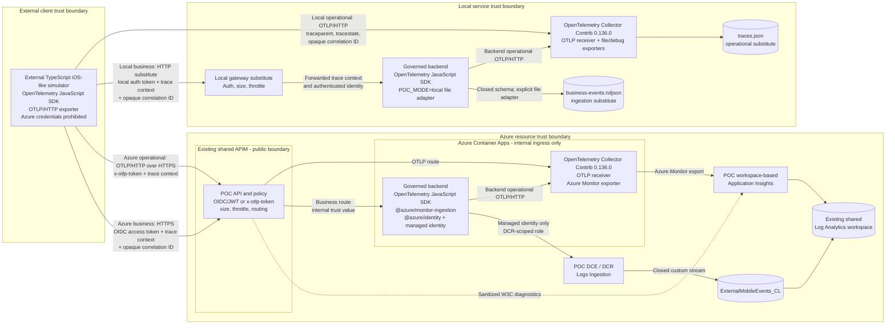

# POC architecture

The POC keeps operational telemetry and governed business events on separate
paths. The TypeScript client behaves like an external iOS application; it does
not validate a native Swift exporter or iOS runtime behavior.

The Microsoft `@azure/monitor-opentelemetry` Node.js distribution is an
authoritative production SDK reference, but it is not installed in this POC.
The simulator and backend use the standard OpenTelemetry JavaScript SDK so both
send operational telemetry through the controlled Collector. The backend uses
Microsoft `@azure/monitor-ingestion` only for governed custom-table delivery.

## Legend and trust model

- Solid arrows are data paths. The dotted arrow is APIM operational
  diagnostics. Operational data lands through Application Insights; approved
  business records land only in `ExternalMobileEvents_CL`.
- `traceparent` and `tracestate` preserve W3C distributed tracing. A separate,
  validated opaque correlation ID joins operational telemetry to the minimized
  business record without copying request payloads.
- Azure service credentials, workspace keys, DCR authorization tokens, client
  secrets, and backend-only configuration are prohibited in the simulator.
  The external client uses only its API identity and the POC OTLP edge token.
- APIM holds edge policy configuration and secure values. The backend alone
  uses managed identity for Logs Ingestion. The Collector receives its
  Application Insights configuration as an Azure Container Apps secret.
- APIM and the Log Analytics workspace are existing shared resources. The
  backend, Collector, Application Insights resource, DCE/DCR, role assignment,
  and custom table are POC-scoped. Direct public ingress to the Azure backend
  and Collector is disabled.

## External-client contract and POC boundary

The external client demonstrated by this POC:

- Sends versioned business-event JSON only to the governed APIM/backend
  endpoint.
- Includes valid API authentication, W3C `traceparent` context, and the
  validated opaque correlation ID.
- Follows the documented payload-size, event-name, schema-version, field-type,
  length, and closed-property restrictions.
- Sends operational telemetry as OTLP/HTTP only to the controlled APIM or
  Collector endpoint.

APIM enforces edge authentication, content type, request size, throttling,
correlation forwarding, and routing. The backend remains authoritative for
schema validation, sensitive-data rejection, sanitization, server enrichment,
and conversion into the exact DCR and `ExternalMobileEvents_CL` schema.

Platform-specific mobile behavior remains outside this POC: offline buffering,
native application lifecycle integration, background execution, mobile-network
retry policy, durable queues, and native exporter reliability. The backend's
bounded Azure ingestion retry behavior is included and tested, but it does not
represent a mobile SDK retry implementation.

## Local-to-Azure mapping

| Concern                 | Local substitute                         | Azure implementation                                             |
| ----------------------- | ---------------------------------------- | ---------------------------------------------------------------- |
| Public policy boundary  | Fastify gateway on `localhost:3000`      | Existing shared APIM with the POC policy                         |
| Governed business API   | Backend container in explicit local mode | Internal Container Apps backend                                  |
| Operational receiver    | Collector on `localhost:4318`            | Internal Container Apps Collector reached through APIM           |
| Operational destination | `.local-data/traces.json`                | POC workspace-based Application Insights in the shared workspace |
| Business destination    | `.local-data/business-events.ndjson`     | Logs Ingestion through POC DCE/DCR to `ExternalMobileEvents_CL`  |
| Azure authorization     | None; Azure credentials are not required | Backend managed identity scoped to the POC DCR                   |

Local file output is selected only by explicit `POC_MODE=local`; Azure mode
never falls back to local files.
